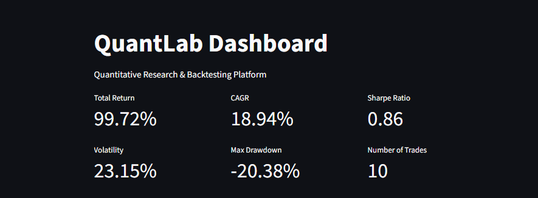
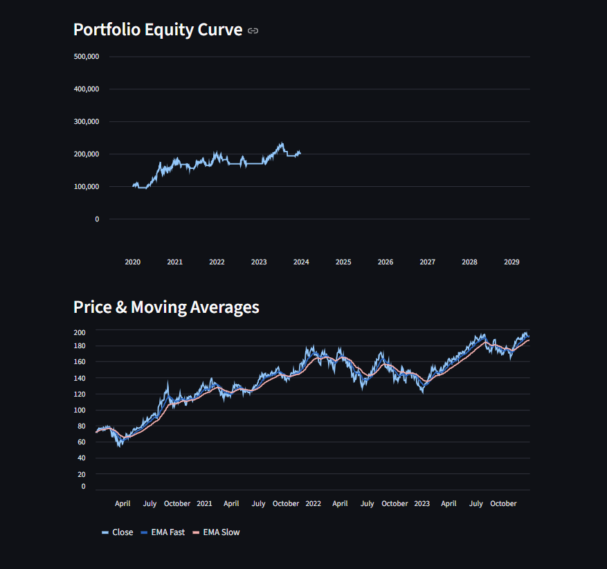
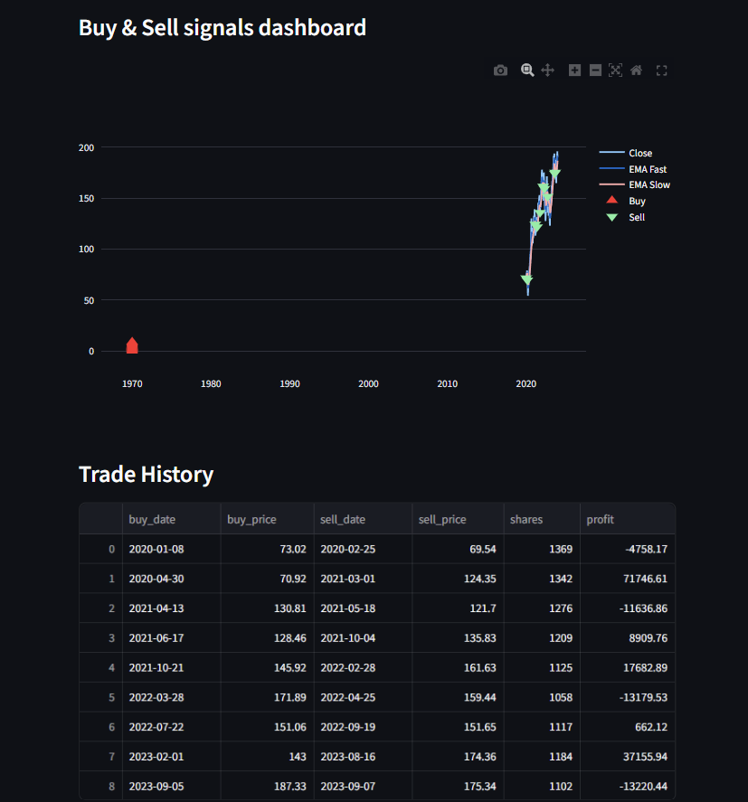

# QuantLab

## End-to-End Quantitative Research & Backtesting Platform

QuantLab is a modular Python framework for developing, testing, and analyzing algorithmic trading strategies.

It provides an end-to-end pipeline for:
- Market data ingestion
- Technical indicator calculation
- Strategy signal generation
- Historical backtesting
- Performance evaluation

The platform includes an interactive Streamlit dashboard for visualizing strategy performance and trade history.

---

# Features

## Data Pipeline
- Historical market data using Yahoo Finance
- Local caching to avoid repeated downloads
- Configurable ticker symbols and date ranges

## Indicators
Modular indicator framework using object-oriented design.

Implemented:
- Exponential Moving Average (EMA)

## Trading Strategies
Reusable strategy architecture.

Implemented:
- EMA Crossover Strategy

## Backtesting Engine
Event-driven simulation engine supporting:

- Buy/Sell execution
- Portfolio tracking
- Trade logging
- Equity curve generation

## Performance Analytics

Implemented metrics:

- Total Return
- CAGR
- Sharpe Ratio
- Volatility
- Maximum Drawdown
- Number of Trades

## Interactive Dashboard

Built with Streamlit:

- Configure ticker and strategy parameters
- Visualize price and moving averages
- View buy/sell signals
- Analyze portfolio growth
- Review trade history

---

# Architecture
Yahoo Finance
|
v
Data Downloader
|
v
Technical Indicators
|
v
Trading Strategies
|
v
Backtesting Engine
|
+------------+
|         |
v         v
Trade Log Equity Curve
|
v
Performance Metrics
|
v
Streamlit Dashboard

# Project Structure
QuantLab/
│
├── data/
│ └── downloader.py
│
├── indicators/
│ ├── base.py
│ └── ema.py
│
├── strategies/
│ ├── base.py
│ └── ema_cross.py
│
├── backtester/
│ └── backtester.py
│
├── analytics/
│ └── metrics.py
│
├── dashboard/
│ └── app.py
│
├── examples/
│ └── backtest_example.py
│
└── requirements.txt

---

# Installation

Clone the repository:

git clone <repository-url>

cd QuantLab

python -m venv .venv

.venv\Scripts\activate

pip install -r requirements.txt

python -m streamlit run dashboard/app.py

Future Improvements
Additional technical indicators (RSI, MACD, Bollinger Bands)
More trading strategies
Parameter optimization
Portfolio-level backtesting
Transaction cost modeling
Machine learning based strategies

Technologies Used
Python
Pandas
NumPy
yFinance
Streamlit
Plotly

Dashboard Preview

